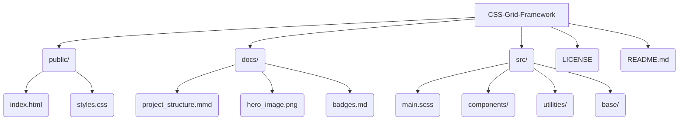
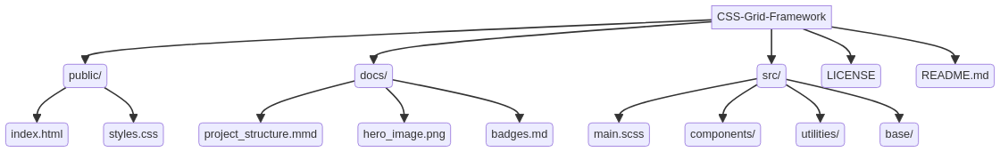

# CSS-Grid-Framework


[](https://opensource.org/licenses/MIT)
[](https://galafis.github.io/CSS-Grid-Framework/public/index.html)
[](https://developer.mozilla.org/en-US/docs/Web/CSS)
[](https://developer.mozilla.org/en-US/docs/Web/HTML)

**Professional CSS Grid Framework**

_Modern CSS framework with advanced styling capabilities and responsive design_

## 🇺🇸 English

### 📋 Overview

Professional CSS Grid Framework developed with modern CSS3 features and best practices. This project showcases advanced CSS development skills, responsive design expertise, and professional frontend styling techniques.

### ✨ Key Features

*   Flexible grid system with 12 columns
*   Responsive breakpoints for all devices
*   CSS Grid and Flexbox integration
*   Utility classes for spacing and alignment
*   Modern CSS custom properties
*   Cross-browser compatibility
*   Lightweight and performant
*   Comprehensive documentation

### 🛠️ Technology Stack

*   **CSS3** - Modern CSS with latest features
*   **HTML5** - Semantic markup structure
*   **Sass/SCSS** - CSS preprocessor (for future enhancements)
*   **PostCSS** - CSS transformation tool (for future enhancements)
*   **Autoprefixer** - Vendor prefix automation (for future enhancements)
*   **CSS Grid & Flexbox** - Modern layout systems
*   **CSS Custom Properties** - Native CSS variables

### 🚀 Quick Start

#### Prerequisites

*   Modern web browser
*   Code editor with CSS support
*   Basic HTML/CSS knowledge

#### Installation & Setup

1.  **Clone the repository**

    ```shell
    git clone https://github.com/galafis/CSS-Grid-Framework.git
    cd CSS-Grid-Framework
    ```

2.  **Open in browser**

    ```shell
    # Simply open public/index.html in your browser
    open public/index.html
    ```

### 📖 Usage Examples

#### Basic Grid Layout

```html
<div class="grid-container grid-gap-medium">
    <div class="grid-item">Item 1</div>
    <div class="grid-item">Item 2</div>
    <div class="grid-item">Item 3</div>
    <div class="grid-item">Item 4</div>
</div>
```

#### Responsive Grid

```html
<div class="grid-container grid-responsive grid-gap-small">
    <div class="grid-item">Col 1</div>
    <div class="grid-item">Col 2</div>
    <div class="grid-item">Col 3</div>
    <div class="grid-item">Col 4</div>
    <div class="grid-item">Col 5</div>
    <div class="grid-item">Col 6</div>
</div>
```

#### Card Components

```html
<div class="grid-container grid-cards grid-gap-large">
    <div class="card">
        <h3>Card Title</h3>
        <p>This is a sample card content.</p>
    </div>
    <!-- More cards -->
</div>
```

### 🏗️ Project Structure





### 📝 License

This project is licensed under the MIT License - see the [LICENSE](LICENSE) file for details.

### 👨‍💻 Author

**Gabriel Demetrios Lafis**

*   GitHub: [@galafis](https://github.com/galafis)
*   LinkedIn: [Gabriel Demetrios Lafis](https://www.linkedin.com/in/gabrieldemetrioslafis/)

**⭐ If this project was helpful to you, consider giving it a star!**

**🚀 Developed with ❤️ by Gabriel Demetrios Lafis**

---

## 🇧🇷 Português

### 📋 Visão Geral

Framework CSS Grid profissional desenvolvido com recursos modernos do CSS3 e melhores práticas. Este projeto demonstra habilidades avançadas de desenvolvimento CSS, expertise em design responsivo e técnicas profissionais de estilização frontend.

### ✨ Principais Funcionalidades

*   Sistema de grid flexível com 12 colunas
*   Breakpoints responsivos para todos os dispositivos
*   Integração CSS Grid e Flexbox
*   Classes utilitárias para espaçamento e alinhamento
*   Propriedades personalizadas CSS modernas
*   Compatibilidade entre navegadores
*   Leve e performático
*   Documentação abrangente

### 🛠️ Stack Tecnológica

*   **CSS3** - CSS moderno com os recursos mais recentes
*   **HTML5** - Estrutura de marcação semântica
*   **Sass/SCSS** - Pré-processador CSS (para futuras melhorias)
*   **PostCSS** - Ferramenta de transformação CSS (para futuras melhorias)
*   **Autoprefixer** - Automação de prefixos de fornecedor (para futuras melhorias)
*   **CSS Grid & Flexbox** - Sistemas de layout modernos
*   **CSS Custom Properties** - Variáveis CSS nativas

### 🚀 Início Rápido

#### Pré-requisitos

*   Navegador web moderno
*   Editor de código com suporte a CSS
*   Conhecimento básico de HTML/CSS

#### Instalação e Configuração

1.  **Clonar o repositório**

    ```shell
    git clone https://github.com/galafis/CSS-Grid-Framework.git
    cd CSS-Grid-Framework
    ```

2.  **Abrir no navegador**

    ```shell
    # Simplesmente abra public/index.html no seu navegador
    open public/index.html
    ```

### 📖 Exemplos de Uso

#### Layout de Grid Básico

```html
<div class="grid-container grid-gap-medium">
    <div class="grid-item">Item 1</div>
    <div class="grid-item">Item 2</div>
    <div class="grid-item">Item 3</div>
    <div class="grid-item">Item 4</div>
</div>
```

#### Grid Responsivo

```html
<div class="grid-container grid-responsive grid-gap-small">
    <div class="grid-item">Col 1</div>
    <div class="grid-item">Col 2</div>
    <div class="grid-item">Col 3</div>
    <div class="grid-item">Col 4</div>
    <div class="grid-item">Col 5</div>
    <div class="grid-item">Col 6</div>
</div>
```

#### Componentes de Cartão

```html
<div class="grid-container grid-cards grid-gap-large">
    <div class="card">
        <h3>Título do Cartão</h3>
        <p>Este é um conteúdo de cartão de exemplo.</p>
    </div>
    <!-- Mais cartões -->
</div>
```

### 🏗️ Estrutura do Projeto


### 📝 Licença

Este projeto está licenciado sob a Licença MIT - veja o arquivo [LICENSE](LICENSE) para detalhes.

### 👨‍💻 Autor

**Gabriel Demetrios Lafis**

*   GitHub: [@galafis](https://github.com/galafis)
*   LinkedIn: [Gabriel Demetrios Lafis](https://www.linkedin.com/in/gabrieldemetrioslafis/)

**⭐ Se este projeto foi útil para você, considere dar uma estrela!**

**🚀 Desenvolvido com ❤️ por Gabriel Demetrios Lafis**

